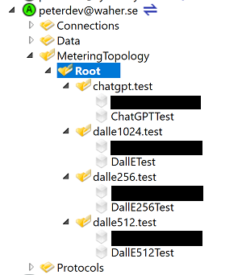

# XmppOpenAIBridge

Provides a bridge between the XMPP Instant Messaging protocol, and OpenAI. The solution
also provides integration with Markdown, allowing for easy use of image and text generation
services provided by OpenAI in Markdown-based content.

## Projects

The solution contains the following C# projects:

| Project                       | Framework         | Description |
|:------------------------------|:------------------|:------------|
| `TAG.Content.Markdown.OpenAI` | .NET Standard 2.0 | Integrates OpenAI services into Markdown, permitting the easy integration of generated text and images based on textual descriptions into Markdown-based content, such as web pages, [wiki content](https://lab.tagroot.io/Documentation/Index.md) or posts and replies in [the community](https://lab.tagroot.io/Community/Index.md). |
| `TAG.Networking.OpenAI`       | .NET Standard 2.0 | Class library for communicating with OpenAI services via the [OpenAI API](https://platform.openai.com/overview). |
| `TAG.Networking.OpenAI.Test`  | .NET 6.0          | Unit tests for the `TAG.Networking.OpenAI` library. |
| `TAG.Things.OpenAI`           | .NET Standard 2.0 | Publishes harmonized interfaces for administering access to OpenAI. The harmonized nodes allow for custom bridging between users of the XMPP protocol and services published by the OpenAI API, such as chatting and image generation. |

## Nugets

The following nugets external are used. They faciliate common programming tasks, and
enables the libraries to be hosted on an [IoT Gateway](https://github.com/PeterWaher/IoTGateway).
This includes hosting the bridge on the [TAG Neuron](https://lab.tagroot.io/Documentation/Index.md).
They can also be used standalone.

| Nuget                                                                              | Description |
|:-----------------------------------------------------------------------------------|:------------|
| [Waher.Content](https://www.nuget.org/packages/Waher.Content/)                     | Pluggable architecture for accessing, encoding and decoding Internet Content. |
| [Waher.Content.Markdown](https://www.nuget.org/packages/Waher.Content.Markdown/)   | An extensible Markdown-engine that parses Markdown, and converts it to various presentation or content formats. |
| [Waher.Content.Xml](https://www.nuget.org/packages/Waher.Content.Xml/)             | Helps with encoding and decoding of XML (and derivatives, such as XHTML). |
| [Waher.Events](https://www.nuget.org/packages/Waher.Events/)                       | An extensible architecture for event logging in the application. |
| [Waher.IoTGateway](https://www.nuget.org/packages/Waher.IoTGateway/)               | Contains the [IoT Gateway](https://github.com/PeterWaher/IoTGateway) hosting environment. |
| [Waher.Networking](https://www.nuget.org/packages/Waher.Networking/)               | Tools for working with communication, including troubleshooting. |
| [Waher.Runtime.Cache](https://www.nuget.org/packages/Waher.Runtime.Cache/)         | Helps with in-memory caching and memory management. |
| [Waher.Runtime.Temporary](https://www.nuget.org/packages/Waher.Runtime.Temporary/) | Library that helps with the management of temporary streams and files. |
| [Waher.Runtime.Timing](https://www.nuget.org/packages/Waher.Runtime.Timing/)       | Helps scheduling future tasks and events in an application. |
| [Waher.Things](https://www.nuget.org/packages/Waher.Things/)                       | Basic architecture enabling the harmonization of things across technology boundaries. |
| [Waher.Things.Xmpp](https://www.nuget.org/packages/Waher.Things.Xmpp/)             | Harmonized extensions for XMPP-based communication and extensions. |

The Unit Tests further use the following libraries:

| Nuget                                                                                            | Description |
|:-------------------------------------------------------------------------------------------------|:------------|
| [Waher.Content.Images](https://www.nuget.org/packages/Waher.Content.Images/)                     | Contains encoders and decoders of images. |
| [Waher.Events.Console](https://www.nuget.org/packages/Waher.Events.Console/)                     | Outputs events logged to the console output. |
| [Waher.Persistence](https://www.nuget.org/packages/Waher.Persistence/)                           | Abstraction layer for object databases. |
| [Waher.Persistence.Files](https://www.nuget.org/packages/Waher.Persistence.Files/)               | An encrypted object database stored as local files. |
| [Waher.Runtime.Inventory](https://www.nuget.org/packages/Waher.Runtime.Inventory/)               | Maintains an inventory of type definitions in the runtime environment, and permits easy instantiation of suitable classes, and inversion of control (IoC). |
| [Waher.Runtime.Inventory.Loader](https://www.nuget.org/packages/Waher.Runtime.Inventory.Loader/) | Permits the inventory and seamless integration of classes defined in all available assemblies. |
| [Waher.Runtime.Settings](https://www.nuget.org/packages/Waher.Runtime.Settings/)                 | Provides easy access to persistent settings. |

## Installable Package

The `TAG.Content.Markdown.OpenAI` project has been made into a package that can be downloaded and installed on any 
[TAG Neuron](https://lab.tagroot.io/Documentation/Index.md), or run on any [IoT Gateway](https://github.com/PeterWaher/IoTGateway).
To create a package, that can be distributed or installed, you begin by creating a *manifest file*. The
`TAG.Content.Markdown.OpenAI` project has a manifest file called `TAG.Content.Markdown.OpenAI.manifest`. It defines the
assemblies and content files included in the package. You then use the `Waher.Utility.Install` and `Waher.Utility.Sign` command-line
tools in the [IoT Gateway](https://github.com/PeterWaher/IoTGateway) repository, to create a package file and cryptographically
sign it for secure distribution across the Neuron network.

The XMPP/OpenAI Bridge is published as a package on TAG Neurons. If your neuron is connected to this network, you can install the
package using the following information:

| Package information ||
|:-----------------|:----|
| Package          | `TAG.XmppOpenAIBridge.package` |
| Installation key | `XGyd1kOAZX3KMhpKLDJ0swJ0Bxwg1lF6Z/DgRScfo/Ys0dxfr4u7U/ofd4zjL00jpi5MJAOIpISAa4982aef95d5daae27ccbbe3f12c38ac` |
| More Information | <https://lab.tagroot.io/Community/Post/OpenAI_integration_with_the_Neuron> |

## Building, Compiling & Debugging

The repository assumes you have the [IoT Gateway](https://github.com/PeterWaher/IoTGateway) repository cloned in a folder called
`C:\My Projects\IoT Gateway`, and that this repository is placed in `C:\My Projects\XmppOpenAIBridge`. You can place the
repositories in different folders, but you need to update the build events accordingly. To run the application, you select the
`TAG.Content.Markdown.OpenAI` project as your stardup project. It will execute the console version of the
[IoT Gateway](https://github.com/PeterWaher/IoTGateway), and make sure the compiled files of the `XmppOpenAIBridge` solution
is run with it.

## Configuring bridges to OpenAI

To create a bridge to OpenAI, the first step is to create a Bridge *node* on the gateway or Neuron. Once the package is installed,
you can do this using, for instance, the *Simple IoT Client*, available in the [IoT Gateway](https://github.com/PeterWaher/IoTGateway)
repository. Follow these steps:

1. As an administrator of the Gateway, make sure your XMPP Address (JID) is on the list to receive notifications from the
gateway. This way, the gateway knows you're an administrator.

2. From your XMPP Client (for example, the *Simple IoT Client*), add your Gateway as a contact, and subscribe to its presence.

3. Once you have an approved subscription, expand the contact, then expand the `MeteringTopology` source node, followed by
the `Root` node.

4. On the `Root` node, add one or more `XMPP Broker` nodes. Each `XMPP Broker` node, creates a separate XMPP connection. You can
point this to the same Neuron, if you're hosting the bridge on a Neuron. If you're hosting the bridge on another type of Gateway,
you need to point it to a Neuron, or some other XMPP Server. The `XMPP Broker` node will maintain a separate XMPP connection to this
Broker, and will receive its own XMPP Address (or JID). The bridge you're creating will be reachable on this JID.

	There are three tabs you need to fill in: On the `IP` Tab, you fill in information about the XMPP Server (or Neuron) you wish
	to connect to. On the `XMPP` tab, you fill in information about the account you will use. On the `Roster` tab, you optionally
	enter a regular expression that will be used to automatically accept presence subscription requests, if they come from JIDs
	matching this expression. (If you don't want automatic presence subscription acceptance, just leave the corresponding regular 
	expression empty.)

5. Once you have an XMPP connection for the bridge (i.e. the `XMPP Broker` node is created and works), you can add an OpenAI
extension node to the `XMPP Broker` node. You select either a `ChatGPT-XMPP Bridge` node or a `DALL-E XMPP Bridge` node, depending
on what type of bridge you want the connection to represent.

	**Note**: It is important to provide the Open AI extension node with a proper identity (ID property). This identity is used in 
	the Markdown integrations, to select the proper gateway to use when converting Markdown code blocks into presentable content.

	**Note 2**: When creating a `ChatGPT-XMPP Bridge` node, make sure to provide proper *instructions* in the corresponding field.
	These instructions are human-readable text that describes the role OpenAI has in the chat. This is the only mechanism available
	to customize ChatGPT.

Once you have completed these steps, you can access the bridge, wither by chatting with them, using the JIDs you've defined above,
or through Markdown, referencing the extensions defined.



## Integration with Markdown

Once the package is installed, the OpenAI bridges will also be available via [Markdown](https://lab.tagroot.io/Markdown.md),
as [code block constructs](https://lab.tagroot.io/Markdown.md#codeBlocks). The `TAG.Content.Markdown.AI` projects defines two
code block extensions: One for ChatGPT, and one for DALL-E. They use bridges defined earlier, so it is important to define them,
even if you don't plan on providing XMPP-bridges to OpenAI.

To add text generated by ChatGPT to Markdown content, add a code block as follows:

	```chatgpt,ChatGPT:Text example
	What do you know about the XMPP protocol?
	```

The first `chatgpt` identifies the ChatGPT Code block Markdown extension defined in `ChatGptCodeBlock.cs` in the
`TAG.Content.Markdown.OpenAI` project. The second parameter (after the comma) `ChatGPT` refers to a Node with the `ID` property
set to this value. The text after the colon `:` is the title of the code block. (For text generation, this title is not shown).

For showing an image, generated by DALL-E, a similar construct can be used:

	```dalle512,DallE:A blue dragon on skates
	A blue dragon on skates
	```

The first `dalle512` identifies the DALL-E Code block Markdown extension defined in `DallECodeBlock.cs` in the same project. It
also defines the size of images generated (512x512). (There are three sizes supported by DALL-E: 256x256, 512x512 and 1024x1024).
The second parameter (after the comma) identifies the corresponding node to use. It must have its `ID` property set to the same
value. The text after the colon `:` is the title of the code block, and will be shown below the image.

**Note**: It is the node defined above, that contains the API Key. This key is necessary for making the call. You can use
different nodes in different content, if you wish to use different API Keys (and therefore distribute associated costs, depending
on type of content.)

## Speech to text conversion

The OpenAI bridges support speech to text conversion. To use this function simply send an URI that points to the audio containing
the speech. In XMPP this can be achieved in various ways:

1. Upload audio file to Neuron using HTTP-upload, and send the resulting URI
2. Publish access to the audio file via the [HTTPX XEP-0332 extension](https://xmpp.org/extensions/xep-0332.html).

## Trying the XMPP Bridges

You can try the bridges without installing the package, by connecting and chatting with the following JIDs:

| Open OpenAI-bridges available ||
| JID | Description              |
|:---------------------------|:------------------------------------------------|
| `chatgpt@lab.tagroot.io`   | ChatGPT-XMPP bridge with minimal instruction.   |
| `dalle256@lab.tagroot.io`  | DALL-E-XMPP bridge generating 256x256 images.   |
| `dalle512@lab.tagroot.io`  | DALL-E-XMPP bridge generating 512x512 images.   |
| `dalle1024@lab.tagroot.io` | DALL-E-XMPP bridge generating 1024x1024 images. |

If you use an XMPP Client / Chat Client, that can scan QR codes, you can also scan the following codes to interact with the
above bridges:

### ChatGPT


### DALL-E (256x256)


### DALL-E (512x125)


### DALL-E (1024x1024)


## OpenAI script Extensions 

The following functions are available on systems with the `TAG.XmppOpenAIBridge.package` installed. A more detailed description
about the OpenAI-related functions referenced in this section is available in the [XmppOpenAIBridge repository](https://github.com/Trust-Anchor-Group/XmppOpenAIBridge).

| Function                                                                      | Description                                           |
|-------------------------------------------------------------------------------|-------------------------------------------------------|
| `ChatGpt(Instruction[,Sender],Text[,Functions],History[,Preview])             | Calls the chat completion API of OpenAI (ChatGPT). The `Instruction` argument contains initialization instructions. The optional `Sender` argument contains the JID of the sender. If not provided, the JID of the quick-login user will be used. Text is the chat message to send. `Functions` contains a single function definition or a vector of function definitions the API can call if it chooses to. `History` is a boolean parameter that indicates if the session history should be included in the query. The optional `Preview` argument indicates if intermediate content responses are previewed during the execution of the query. The response to the call will be an object containing a `Content` property with textual content, a `Function` property with function call information if available, including a `Result` property, containing any results from a function call. If a function call is requested, available function definitions or lambda expressions will be checked. If available, they will be called, with the arguments available from the API. |
| `ChatGptConfigured()`                                                         | Checks if Chat GPT is configured correctly. It requires a Chat GPT<->XMPP Bridge node to be configured in the `MeteringTology` source, with the Node ID `ChatGPT`. |
| `ChatGptArray(Name,Description,Required,ItemParameter)                        | Creates an array parameter for callback functions. The `ItemParameter` argument contains definition of each item in the array. |
| `ChatGptBoolean(Name,Description,Required)                                    | Creates a Boolean parameter for callback functions. |
| `ChatGptEnum(Name,Description,Required,Values)                                | Creates an enumeration parameter for callback functions. The `Values` argument contains a vector of strings representing the possible values the argument can take. |
| `ChatGptFunction(Name,Description,Parameters)                                 | Creates a function definition for callback functions. The `Parameters` argument contains a vector of parameter definitions representing the arguments of the function. |
| `ChatGptInteger(Name,Description,Required[,MultipleOf])                       | Creates an integer parameter for callback functions, possibly requiring it to be a multiple of a given base value. |
| `ChatGptInteger(Name,Description,Required[,Min,MinInc,Max,MaxInc])            | Creates an integer parameter for callback functions, possibly within a specified range, between Min and Max, specifying also if the endpoints are included or not. |
| `ChatGptInteger(Name,Description,Required[,MultipleOf,Min,MinInc,Max,MaxInc]) | Creates an integer parameter for callback functions, possibly requiring it to be a multiple of a given base value, as well as within a specified range, between Min and Max, specifying also if the endpoints are included or not. |
| `ChatGptNumber(Name,Description,Required[,MultipleOf])                        | Creates a number (float-point) parameter for callback functions, possibly requiring it to be a multiple of a given base value. |
| `ChatGptNumber(Name,Description,Required[,Min,MinInc,Max,MaxInc])             | Creates a number (float-point) parameter for callback functions, possibly within a specified range, between Min and Max, specifying also if the endpoints are included or not. |
| `ChatGptNumber(Name,Description,Required[,MultipleOf,Min,MinInc,Max,MaxInc])  | Creates a number (float-point) parameter for callback functions, possibly requiring it to be a multiple of a given base value, as well as within a specified range, between Min and Max, specifying also if the endpoints are included or not. |
| `ChatGptObject(Name,Description,Required,Properties)                          | Creates an object parameter for callback functions. The `Properties` argument contains a vector of parameter definitions representing the properties of the object. |
| `ChatGptString(Name,Description,Required[,Pattern])                           | Creates a string parameter for callback functions, having a regular expression to validate input. |
| `ChatGptString(Name,Description,Required[,Format])                            | Creates a string parameter for callback functions, having a specific format, as given by the string format enumeration listed below. |

The String format enumeration can have the following values:

| Enumeration Value     | Corresponding JSON Schema string | Description or example |
|:----------------------|:---------------------------------|:-----------------------|
| `DateTime`              | `date-time`                        | Date and time together, for example, 2018-11-13T20:20:39+00:00. |
| `Time`                  | `time`                             | New in draft 7 Time, for example, 20:20:39+00:00 |
| `Date`                  | `date`                             | New in draft 7 Date, for example, 2018-11-13. |
| `Duration`              | `duration`                         | New in draft 2019-09 A duration as defined by the ISO 8601 ABNF for “duration”. For example, P3D expresses a duration of 3 days. |
| `EMail`                 | `email`                            | Internet email address, see RFC 5321, section 4.1.2. |
| `InternationalEMail`    | `idn-email`                        | New in draft 7 The internationalized form of an Internet email address, see RFC 6531. |
| `HostName`              | `hostname`                         | Internet host name, see RFC 1123, section 2.1. |
| `InternationalHostname` | `idn-hostname`                     | New in draft 7 An internationalized Internet host name, see RFC5890, section 2.3.2.3. |
| `IPv4`                  | `ipv4`                             | IPv4 address, according to dotted-quad ABNF syntax as defined in RFC 2673, section 3.2. |
| `IPv6`                  | `ipv6`                             | IPv6 address, as defined in RFC 2373, section 2.2. |
| `Uuid`                  | `uuid`                             | New in draft 2019-09 A Universally Unique Identifier as defined by RFC 4122. Example: 3e4666bf-d5e5-4aa7-b8ce-cefe41c7568a |
| `Uri`                   | `uri`                              | A universal resource identifier (URI), according to RFC3986. |
| `UriReference`          | `uri-reference`                    | New in draft 6 A URI Reference (either a URI or a relative-reference), according to RFC3986, section 4.1. |
| `Iri`                   | `iri`                              | New in draft 7 The internationalized equivalent of a “uri”, according to RFC3987. |
| `IriReference`          | `iri-reference`                    | New in draft 7 The internationalized equivalent of a “uri-reference”, according to RFC3987 |
| `UriTemplate`           | `uri-template`                     | New in draft 6 A URI Template (of any level) according to RFC6570. If you don’t already know what a URI Template is, you probably don’t need this value. |
| `JsonPointer`           | `json-pointer`                     | New in draft 6 A JSON Pointer, according to RFC6901. There is more discussion on the use of JSON Pointer within JSON Schema in Structuring a complex schema. Note that this should be used only when the entire string contains only JSON Pointer content, e.g. /foo/bar. JSON Pointer URI fragments, e.g. #/foo/bar/ should use "uri-reference". |
| `RelativeJsonPointer`   | `relative-json-pointer`            | New in draft 7 A relative JSON pointer. |
| `RegEx`                 | `regex`                            | New in draft 7 A regular expression, which should be valid according to the ECMA 262 dialect. |

Example:

```
ShowImage(Image):=
(
	Get(Image.Url) ??? "Image not available"
);

ShowImages(Images):=
(
	[foreach Image in Images do ShowImage(Image)]
);

R:=ChatGpt(
	"You help users find images on the Internet, representative of the queries made by the user.",
	"TestUser",
	"Kan you find me some images of Kermit? If something is unclear, ask for additional information first. When ready to present images to the user, call available functions.",
	ChatGptFunction("ShowImages", "Displays an array of images to the user.", [
		ChatGptArray("Images", "Array of images to show.", true, 
			ChatGptObject("Image", "Information about an image.", true, [
				ChatGptString("Url", "URL to the image to show.", true),
				ChatGptInteger("Width","Width of image, in pixels.", false, 0, false, null, false),
				ChatGptInteger("Height","Height of image, in pixels.", false, 0, false, null, false),
				ChatGptString("Alt", "Alternative textual description of image, in cases the image cannot be shown.", false)]))]),
	false,
	true)
```

**Note**: If running script with ChatGPT-services on a web server, you can use the associated script functions to push information
asynchronously back to the web client using the [`PushEvent` script function](https://lab.tagroot.io/Script.md).

Example Result (prettyfied):

```
{
   "Content": "",
   "Function": {
      "Name": "ShowImages",
      "Arguments": {
         "Images": [
            {
               "Url": "https://upload.wikimedia.org/wikipedia/en/6/62/Kermit_the_Frog.jpg",
               "Width": 220,
               "Height": 252,
               "Alt": "Kermit the Frog"
            },
            {
               "Url": "https://static.wikia.nocookie.net/muppet/images/7/79/Kermitfullfigure.jpg",
               "Width": 323,
               "Height": 643,
               "Alt": "Full-length image of Kermit"
            },
            {
               "Url": "https://c.tenor.com/3o6_GbQ7Ic8AAAAd/kermit-the-frog-dancing.gif",
               "Width": 499,
               "Height": 280,
               "Alt": "Kermit dancing gif"
            }
         ]
      },
      "Result": [
         {
            "Width": 282,
            "Height": 353,
            "UniqueId": 542,
            "AlphaType": "Opaque",
            "ColorType": "Bgra8888",
            "ColorSpace": null,
            "IsAlphaOnly": false,
            "EncodedData": null,
            "Info": {
               "Width": 282,
               "Height": 353,
               "ColorType": "Bgra8888",
               "AlphaType": "Opaque",
               "ColorSpace": null,
               "BytesPerPixel": 4,
               "BitsPerPixel": 32,
               "BytesSize": 398184,
               "BytesSize64": 398184,
               "RowBytes": 1128,
               "RowBytes64": 1128,
               "IsEmpty": false,
               "IsOpaque": true,
               "Size": {
                  "IsEmpty": false,
                  "Width": 282,
                  "Height": 353
               },
               "Rect": {
                  "MidX": 141,
                  "MidY": 176,
                  "Width": 282,
                  "Height": 353,
                  "IsEmpty": false,
                  "Size": {
                     "IsEmpty": false,
                     "Width": 282,
                     "Height": 353
                  },
                  "Location": {
                     "IsEmpty": true,
                     "Length": 0,
                     "LengthSquared": 0,
                     "X": 0,
                     "Y": 0
                  },
                  "Left": 0,
                  "Top": 0,
                  "Right": 282,
                  "Bottom": 353
               }
            },
            "IsTextureBacked": false,
            "IsLazyGenerated": false,
            "Handle": {
               "Size": 4
            }
         },
         "Image not available",
         "Image not available"
      ]
   }
}
```